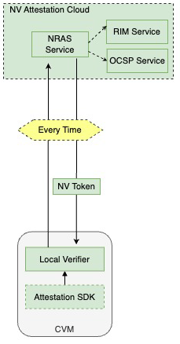
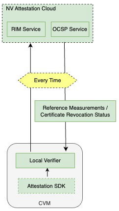
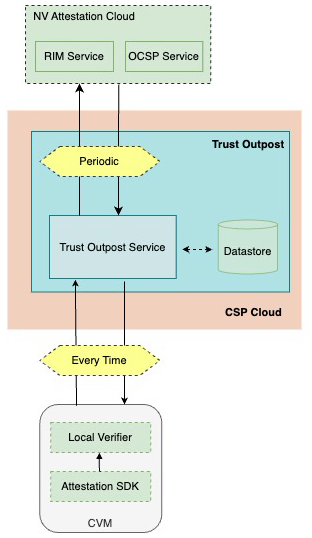

# NVIDIA GPU Attestation Guide

This guide provides a comprehensive overview of NVIDIA GPU Attestation and outlines the steps to implement it in your environment.

## Table of Contents

- [NVIDIA GPU Attestation Guide](#nvidia-gpu-attestation-guide)
  - [Table of Contents](#table-of-contents)
  - [Pre-requisites](#pre-requisites)
  - [Attestation Using SDK - A Primer](#attestation-using-sdk---a-primer)
  - [Quick Start](#quick-start)
  - [NVIDIA Attestation Service Integration Options](#nvidia-attestation-service-integration-options)
    - [Option 1: NVIDIA-Managed Attestation (Most Secure)](#option-1-nvidia-managed-attestation-most-secure)
    - [Option 2: Hybrid Attestation](#option-2-hybrid-attestation)
    - [Option 3: Customer-Managed Attestation](#option-3-customer-managed-attestation)
  - [Comparison of Options](#comparison-of-options)
  - [License](#license)
- [Support](#support)

## Pre-requisites

1. Install Attestation SDK using [this guide](./attestation_sdk/README.md). This in turn installs Local GPU Verifier.
2. [Optional] Review the [NVIDIA NGC Status Page](https://status.ngc.nvidia.com/) to ensure NVIDIA Remote Attestation Service (NRAS), RIM Service, and OCSP Service are functional.

## Attestation Using SDK - A Primer

Attestation using the SDK involves three main steps:

1. Add a verifier

    ```python
    client = attestation.Attestation()
    client.add_verifier(attestation.Devices.GPU, attestation.Environment.REMOTE, NRAS_URL, "")
    ```
2. Get GPU Evidence

    ```python
    evidence_list = client.get_evidence()
    ```
3. Perform Attestation and optionally validate results using a JSON-based Relying Party policy

    ```python
    client.validate_token(JSON_POLICY)
    ```

## Quick Start

1. Navigate to the `nvtrust/guest_tools/attestation_sdk/tests/end_to_end/hardware` directory.
  
    ```bash
    cd nvtrust/guest_tools/attestation_sdk/tests/end_to_end/hardware
    ```
2. Run `RemoteGPUTest.py` or `LocalGPUTest.py`

    ```bash
    python LocalGPUTest.py
    # or
    python RemoteGPUTest.py
    ```

## NVIDIA Attestation Service Integration Options

### Option 1: NVIDIA-Managed Attestation (Most Secure)



This model offers the highest level of security and operational simplicity, leveraging NVIDIA's cloud-based attestation services for comprehensive verification.

**Key Components:**
- Local GPU Verifier: Collects evidence from the GPU
- NVIDIA Cloud Services: Remote Attestation, RIM, and OCSP services

**Example:**
```python
# Code snippet from nvtrust/guest_tools/attestation_sdk/tests/end_to_end/hardware/RemoteGPUTest.py
#
client = attestation.Attestation()
client.add_verifier(attestation.Devices.GPU, attestation.Environment.REMOTE, NRAS_URL, "")
evidence_list = client.get_evidence()
client.attest(evidence_list)
```

### Option 2: Hybrid Attestation



This model balances local control with cloud-based support, allowing for local comparison & verification of values while still utilizing  NVIDIA cloud services.

**Key Components:**
- Local GPU Verifier: Handles both evidence collection and verification
- NVIDIA Cloud Services: NVIDIA RIM and OCSP services 

**Example:**
```python
# Code snippet from nvtrust/guest_tools/attestation_sdk/tests/end_to_end/hardware/LocalGPUTest.py
#
client = attestation.Attestation()
client.add_verifier(attestation.Devices.GPU, attestation.Environment.LOCAL, "", "", OCSP_URL, RIM_URL)
evidence_list = client.get_evidence()
client.attest(evidence_list)
```

### Option 3: Customer-Managed Attestation

NVIDIA also offers Trust Outpost, a comprehensive GPU attestation solution for end-to-end GPU attestation designed for high-scale deployments and organizations needing enhanced local control. This on-premises implementation efficiently caches RIM and OCSP data, ideal for environments with strict data sovereignty or air-gapped systems. Access requires appropriate agreements with NVIDIA - please contact [attestation-support@nvidia.com](mailto:attestation-support@nvidia.com) to request participation in the program.



## Comparison of Options

| Feature | Cloud-Managed | Hybrid | Trust Outpost |
|---------|---------------|--------|-----------------|
| Security Level | Highest | High | High |
| Operational Complexity | Lowest | Moderate | Highest |
| Local Control | Lowest | Moderate | Highest |
| Cloud Dependency | Highest | Moderate | Lowest |
| Best For | Maximum security and simplicity | Balanced approach | Strict control requirements |

## License
This repository is licensed under Apache License v2.0 except where otherwise noted.

Users who use NVIDIA Attestation Cloud Services or the NVIDIA Trust software components, without an Enterprise Product license may exercise the software and services solely for the purposes of development of a confidential computing service, not a commercial offering/ redistribution. A commercial Enterprise Product license must be obtained before offering the software within a paid commercial service.

# Support
For issues or questions, please [file a bug](https://github.com/NVIDIA/nvtrust/issues). For additional support, contact us at [attestation-support@nvidia.com](mailto:attestation-support@nvidia.com)

