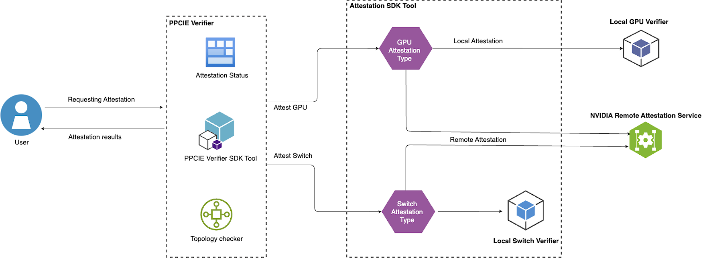
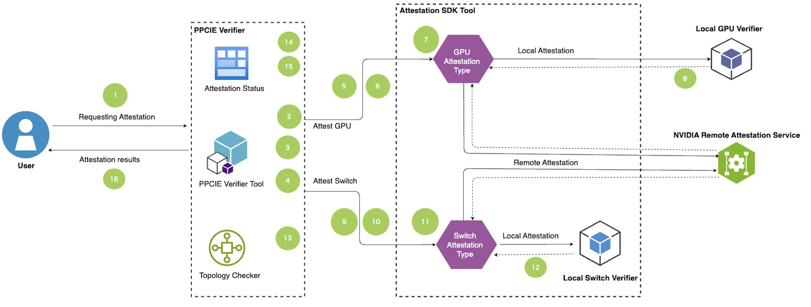
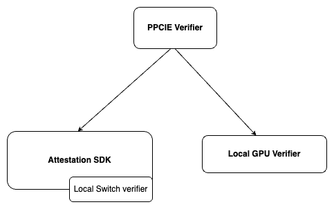

# Protected PCIE Verifier 
``````markdown
   - Overview 
   - Architecture diagram
   - Getting Started
      - Prerequisites
      - Installation
      - Usage
      - Troubleshooting
   - License
``````
## Overview ✨
In a multi-GPU confidential computing setup, NvLink interconnects/switches are not trusted and is not allowed to carry & access sensitive plain-text data. 
Any data that flows over NvLink must be encrypted by CE prior to transfer and decrypted on the destination.

Bouncing through CE adds additional constraints & latency to the data path resulting in performance drop significant enough for some customers to not consider CC. 
So, an alternate option to trade in security for performance has been proposed and accepted by customers. 
This new option which is called as ‘Trusted NvLink Mode’ trusts NvLink interconnects and allow plain-text traffic to flow without bouncing through crypto engines.

**Note**: CC mode and PPCIE mode for GPUs are mutually exclusive. To run the PPCIE Verifier, one of these two modes must be enabled on the system.

## High Level Architecture Diagram 🚀


The PPCIE Verifier is a tool designed to verify the security of a system by attesting to the integrity of its individual components, including GPUs and NvSwitches. Each device undergoes a security settings check to ensure data can be processed confidentially. The attestation SDK is used to gather evidence for each device, with further attestation performed either locally or remotely, as specified by the user when running the PPCIE Verifier tool.

After collecting attestation results for each device, the PPCIE Verifier validates these results against a policy file to confirm that all claims are legitimate. Following the attestation process, the tool conducts a final topology check to verify that the devices are securely connected in the expected configuration. The final attestation results are then presented to the user, detailing the checks performed.

### Detailed Architecture Flow


1. The PPCIE Verifier tool is initiated by the user, who specifies the attestation mode for both GPUs and NvSwitches.
2. The system components are enumerated (number of GPUs and NvSwitches).
3. Pre-checks are performed on each GPU to ensure it is configured for confidential computing.
4. Pre-checks are performed on each NvSwitch to ensure it is configured for confidential computing.
5. The required GPU evidence for attestation is collected from the Attestation SDK for each GPU.
6. Once the evidence is collected, the PPCIE Verifier tool initiates attestation based on the mode specified by the user.
7. GPU attestation is initiated by the Attestation SDK: the local-gpu-verifier is used for local attestation, while NRAS (NVIDIA's Remote Attestation Service) is used for remote attestation.
8. The Attestation SDK provides GPU attestation results to the PPCIE Verifier.
9. The PPCIE Verifier proceeds to collect evidence for the NvSwitches from the Attestation SDK.
10. Once all NvSwitch evidence is collected, attestation is initiated by the PPCIE Verifier.
11. NvSwitch attestation is performed by the Attestation SDK: the local-switch-verifier is used for local attestation, while NRAS is used for remote attestation.
12. The Attestation SDK provides NvSwitch attestation results to the PPCIE Verifier.
13. The PPCIE Verifier performs a topology check to ensure that the devices are securely connected in the expected configuration.
14. The PPCIE Verifier determines the overall results and updates the status for each milestone.
15. The GPU ready state is set.
16. The final attestation results are presented to the user, detailing the checks performed and the status of each device in the system.

## Getting started

### Prerequisites:
    HGX system with 8 GPUs and 4 switches
    python >= 3.8
    git installed
    Nvidia GPU driver installed
    Nvidia Switch driver installed
    Nvidia Fabric Manager installed

### Installation/Dependencies:


PPCIE Verifier has the following dependencies:

1. nv-attestation-sdk (Attestation SDK)
2. nv-local-gpu-verifier (Local GPU Verifier)
3. nv-switch-verifier (Local Switch Verifier) Note: nv-switch-verifier (Local Switch Verifier) This is a module inside attestation-sdk and does not require separate installation

Installation Instructions:

Please elevate to Root User Privileges before installing the packages: (Note: This is needed to set the GPU ready state)
         
         sudo -i
         
Method 1: Using installer script
            
            1. git clone https://github.com/NVIDIA/nvtrust/tree/main
            2. cd nvtrust/guest_tools/ppcie-verifier/install
            3. source ppcie-installer.sh  (This would install the required dependencies)

Method 2: Using PyPI (Requires python virtual environment creation)
            
            1. python3 -m venv venv
            2. source venv/bin/activate
            3. pip3 install nv-ppcie-verifier (This would automatically install nv-attestation-sdk, nv-local-gpu-verifier and nv-switch-verifier)


### Usage:
    python3 -m ppcie.verifier.verification --gpu-attestation-mode=LOCAL --switch-attestation-mode=LOCAL (Example arguments provided)

#### Options
  
| Option                     | Description                           | Value Options                                                            |
|----------------------------|---------------------------------------|--------------------------------------------------------------------------|
| `--gpu-attestation-mode`   | Type of GPU Attestation               | LOCAL, REMOTE                                                          |
| `--switch-attestation-mode`| Type of nvSwitch Attestation          | LOCAL,  REMOTE                                                          |
| `--log`                    | Configure log level                   | DEBUG, INFO, WARNING, ERROR, TRACE, CRITICAL               |


## Troubleshooting
Below are some of the common issues that has been encountered:
### Installation Issues:
1. `ModuleNotFoundError: No module named 'nv_attestation_sdk'` while installing the packages using the installer script(ppcie-installer.sh)

     **Solution**: Delete the venv created and re-try installing the packages using the script again
2. If you encounter warning and installation issues similar to below while installing the package:
    `WARNING: Ignoring invalid distribution ~v-attestation-sdk <site-package-directory>`
Please execute the following commands to clean up packages that were not installed properly and then re-try the installation:
     
      **Solution**: `rm -rf $(ls -l <site-packages-directory> | grep '~' | awk '{print $9}')`

### Configuration Issues:
1. `The nvmlInit call timed out.` or `Error in Initializing NVML library. Please install the drivers again and re-try`

    **Solution**: This requires re-installing the Nvidia GPU driver and fabric manager 
2. `NSCQWarning: NSCQ_RC_WARNING_RDT_INIT_FAILURE`

    **Solution**: This requires installing the correct version of Nvidia Switch driver compatible with GPU driver

## License
The license for this repository is Apache v2 except where otherwise noted.
